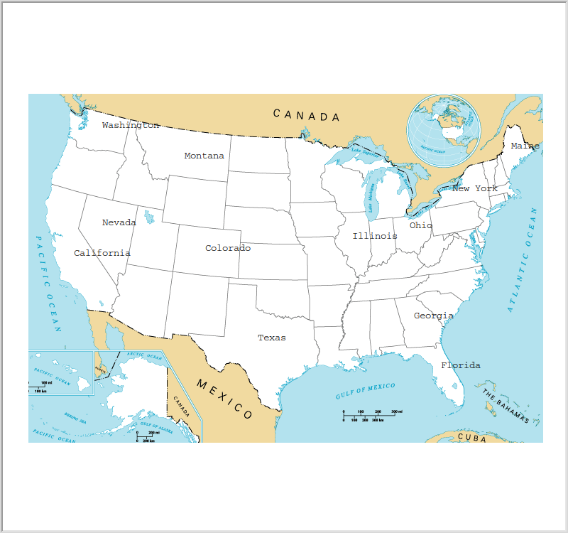

# 🗺️ US States Quiz Game

An interactive geography quiz built in Python. Guess the names of all 50 US states, and each correct answer is written onto a blank map at the state's location.



## Features
- Type state names into a pop-up input box
- Correct answers appear on the map in the right place
- Progress counter out of 50
- Type `exit` to stop. The states you missed are saved to a file (`States_to_learn`) so you can revise them

## How to run
Requires Python 3 and pandas.

```bash
pip install pandas
python US_states_game.py
```

## Project structure
| File | Purpose |
|------|---------|
| `US_states_game.py` | Main quiz program |
| `50_states.csv` | State names with their x/y map coordinates |
| `blank_states_img.gif` | Blank US map image |
| `States_to_learn` | Generated list of states you missed |

## What I learned
Reading and writing CSV files with pandas, working with DataFrames, and combining data with a graphical interface.

---
Built while following Dr. Angela Yu's *100 Days of Code: The Complete Python Pro Bootcamp* (Udemy).
